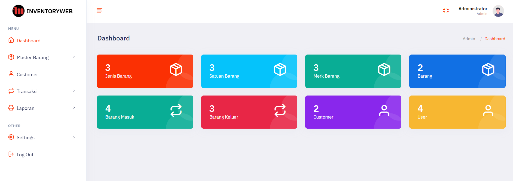

## *:information_source: Inventoryweb*
**Inventoryweb** adalah aplikasi manajemen inventory berbasis web (Laravel 9) untuk mencatat dan mengontrol keluar-masuk stok barang. Aplikasi ini mempermudah pencatatan transaksi barang masuk & keluar, memantau stok per barang, serta menghasilkan laporan (termasuk export PDF) berdasarkan rentang tanggal tertentu.

Aplikasi ini juga punya sistem **hak akses berbasis role** (Super Admin, Admin, Operator, Manajer) yang bisa diatur menu per menu — setiap role bisa dibatasi hak `view`/`create`/`update`/`delete`-nya secara terpisah lewat menu Akses.
<br><br>
Untuk tampilannya saya sudah pasang template admin `bootstrap v5` yaitu `sash admin`.

## *:sparkles: Fitur*
* **Dashboard**
* **Jenis Barang**
* **Satuan Barang**
* **Merk Barang**
* **Barang**
* **Customer**
* **Barang Masuk**
* **Barang Keluar**
* **Laporan Barang Masuk**
* **Laporan Barang Keluar**
* **Laporan Stok Barang**
* **Setting Website**
* **Setting Hak Akses user per Role**
* **Setting Menu (bisa tambah menu atau bisa hapus menu)**

## *:electric_plug: Plugin*
* **Yajra Datatables**
* **SweetAlert**
* **jQuery**
* **Datetime picker**

## *:gear: Requirement*
<p>


</p>

## *:rocket: Instalasi*
#### :arrow_right: Clone Project / Download File
Clone Project dengan perintah terminal `gitbash` sebagai berikut:
```
git clone git@github.com:Mohammadagil/Project-Inventory-Web-PT.Tjakrindo-Mas.git
```
Atau bisa klik tombol download Zip dan extrak file tersebut
#### :arrow_right: Buat Database
Buat Database kosong bernama `db_inventoryweb` di MySQL/MariaDB kalian (lewat phpMyAdmin, TablePlus, atau tool lain).

#### :arrow_right: Config ENV
Project ini **tidak menyertakan file `.env`** (ada di `.gitignore`), jadi buat sendiri file `.env` baru di root project dengan isi minimal berikut:
```env
APP_NAME=Inventoryweb
APP_ENV=local
APP_KEY=
APP_DEBUG=true
APP_URL=http://localhost

DB_CONNECTION=mysql
DB_HOST=127.0.0.1
DB_PORT=3306
DB_DATABASE=db_inventoryweb
DB_USERNAME=root
DB_PASSWORD=
```
Sesuaikan `DB_DATABASE`, `DB_USERNAME`, `DB_PASSWORD` dengan kredensial MySQL kalian.

#### :arrow_right: Set Up
Buka Terminal di proyek folder Anda dan jalankan perintah dibawah ini secara berurutan:
```
composer install
```
> ⚠️ Wajib **PHP 8.1** (bukan 8.2 ke atas) — beberapa dependency (`nette/schema`, `nette/utils`) tidak kompatibel dengan PHP 8.2+ dan akan gagal saat `composer install`.
```
php artisan key:generate
```
```
php artisan storage:link
```
```
npm install
```
```
npm run build
```
> Sebagian besar tampilan (tema admin) sudah statis di folder `public/assets` dan tidak butuh langkah ini. `npm run build` cuma mengcompile asset custom di `resources/css/app.css` & `resources/js/app.js`. Untuk development sambil edit asset custom itu, bisa pakai `npm run dev` (auto-reload) sebagai gantinya.

#### :arrow_right: Import Database
Import file database `database/db/db_inventoryweb.sql` ke database `db_inventoryweb` yang sudah dibuat tadi — lewat phpMyAdmin/TablePlus, atau lewat terminal:
```
mysql -u root -p db_inventoryweb < database/db/db_inventoryweb.sql
```
> Ini cara yang disarankan (bukan `php artisan migrate --seed`) karena file SQL ini sudah berisi data awal lengkap (role, menu, dan 4 user default), sedangkan seeder bawaan project belum selengkap itu.

#### :arrow_right: Jalankan Aplikasi
```
php artisan serve
```
copy & paste `http://127.0.0.1:8000/` ke browser anda — akan otomatis diarahkan ke halaman login.

> **Windows:** kalau `php artisan serve` gagal dengan pesan `Failed to listen on 127.0.0.1:8000 (reason: ?)`, coba jalankan dari **Git Bash**, bukan PowerShell/CMD — di beberapa mesin Windows Defender bisa memblokir PowerShell membuka listening socket.

#### :arrow_right: Login Default
username: `superadmin` password: `12345678`
<br>
username: `admin` password: `12345678`
<br>
username: `operator` password: `12345678`
<br>
username: `manajer` password: `12345678`

## *:bulb: Cara Penggunaan*

Setelah login, urutan penggunaan yang disarankan:

**1. Lengkapi Master Data dulu** (menu di bawah "Master Barang"), sebelum bisa input barang:
- **Jenis Barang** — kategori barang (mis. "Perangkat Komputer")
- **Satuan** — satuan barang (mis. "Pcs", "Kg")
- **Merk** — merk barang (mis. "Asus")
- **Customer** — data pelanggan/pemasok

**2. Tambah data Barang**
Buka menu **Barang**, klik **Tambah Data**, isi kode/nama/jenis/satuan/merk/harga/stok awal, dan (opsional) upload foto barang.

**3. Catat transaksi Barang Masuk / Barang Keluar**
- **Barang Masuk** — saat menerima stok baru dari customer/supplier
- **Barang Keluar** — saat stok keluar (terjual/dipakai)
<br>Kode transaksi ter-generate otomatis, kamu tinggal pilih barang, customer, tanggal, dan jumlah.

**4. Pantau stok lewat Laporan**
Menu **Laporan → Stok Barang** menghitung stok terkini secara otomatis (`stok awal + total masuk − total keluar`), bisa difilter per rentang tanggal, dan bisa di-**print** atau **export ke PDF**. Laporan Barang Masuk/Keluar juga tersedia terpisah dengan cara yang sama.

**5. Atur Menu, Role, User & Hak Akses** (khusus role dengan akses ke menu "Master" — biasanya Super Admin)
- **Menu** — tambah/hapus/urutkan menu sidebar
- **Role** — kelola daftar role (Super Admin, Admin, Operator, Manajer, atau role baru)
- **User** — kelola akun user & role-nya
- **Akses** — atur hak `view`/`create`/`update`/`delete` per role untuk setiap menu (centang/hilangkan centang langsung tersimpan)
- **Web** — ubah nama, logo, dan deskripsi website yang tampil di seluruh halaman

## *:desktop_computer: Preview*
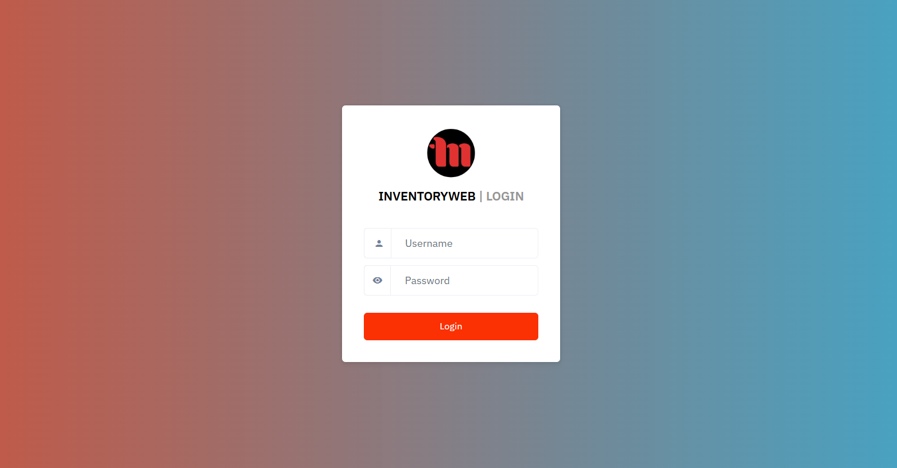
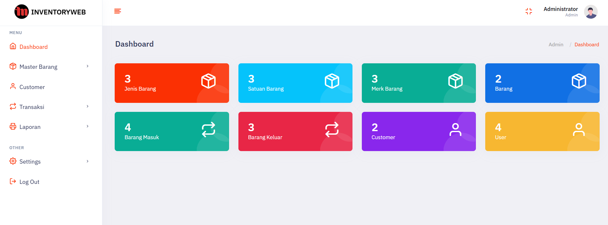
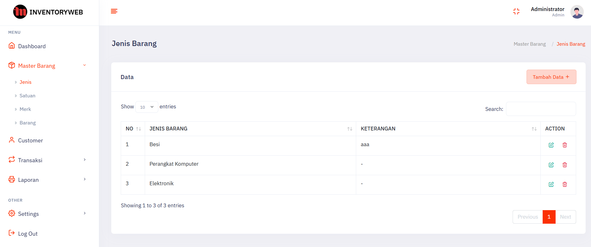
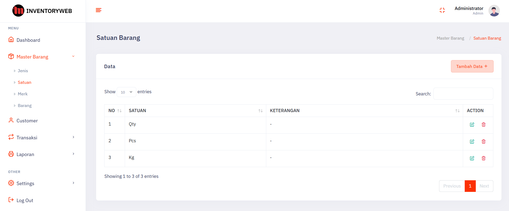
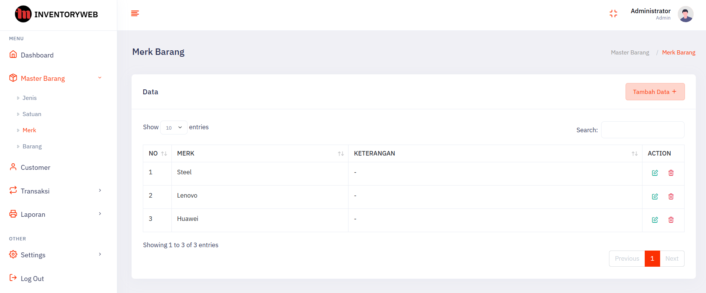
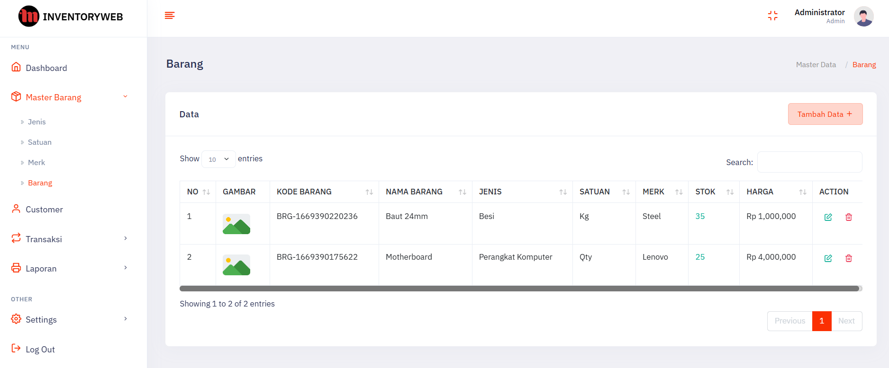
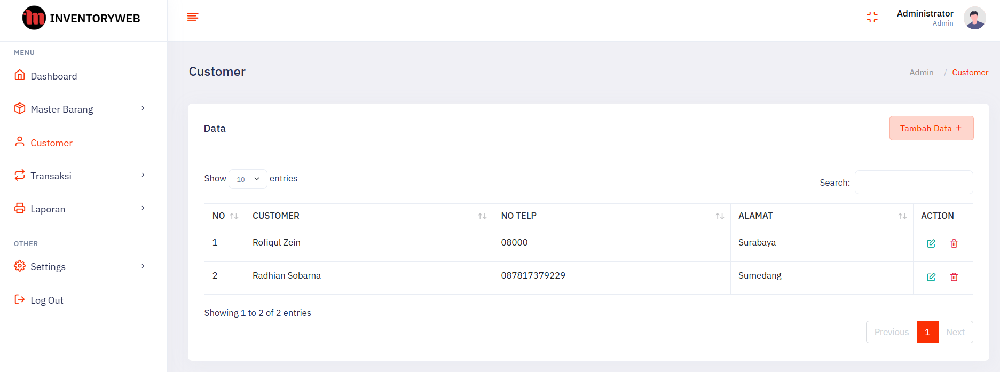
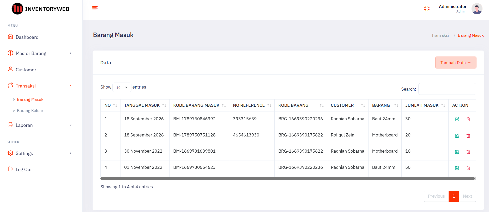
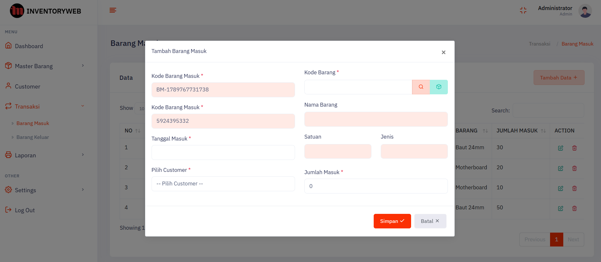
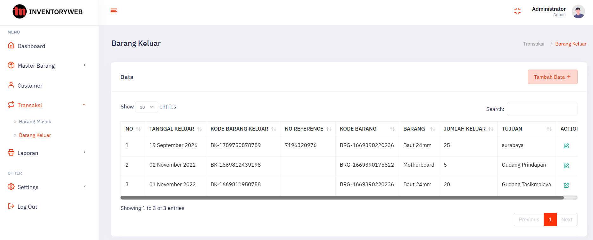
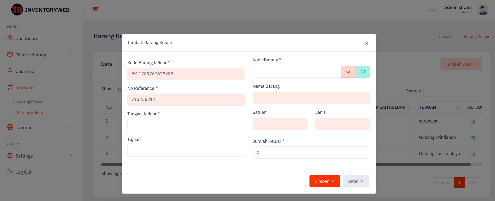
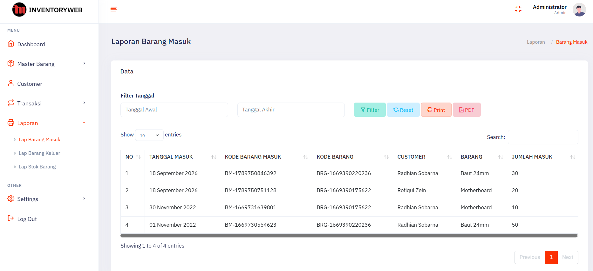
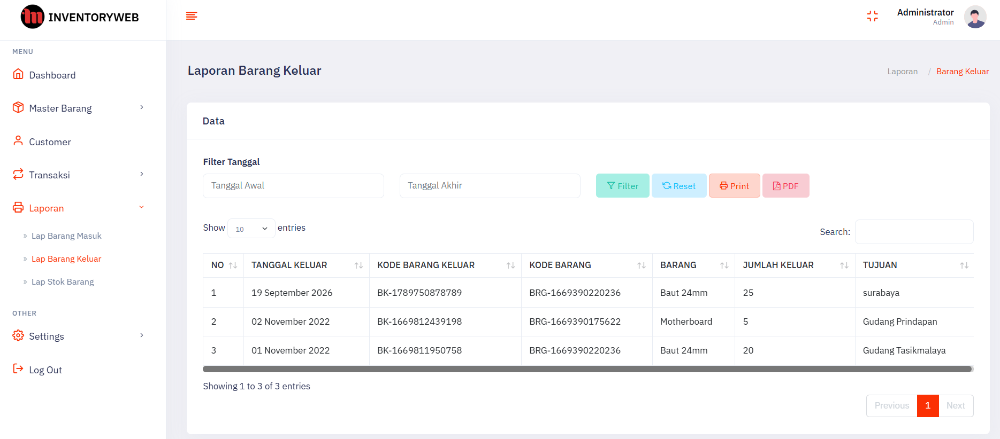
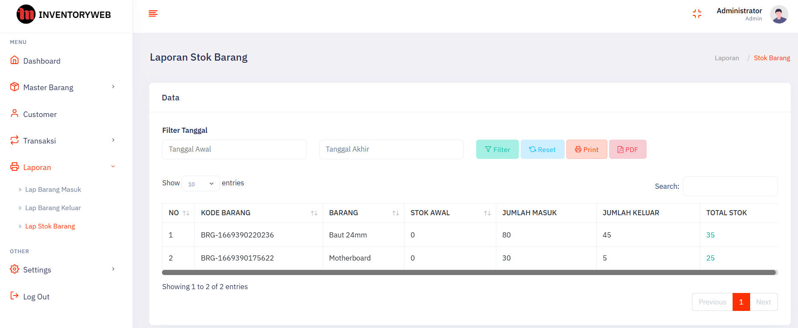

